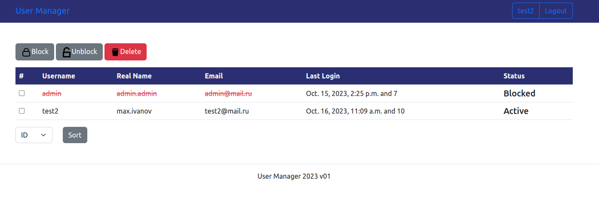

## Welcome to the User Management Console
#### Based on django engine
A powerful tool designed to simplify the management of users within your system. 

This console provides administrators and system operators with the ability to 

efficiently oversee and control user-related activities.

1) python3 -m venv venv
1) source venv/bin/activate
1) python3 -m pip install --upgrade pip
1) python -m pip install -r requirements.txt
1) python3 manage.py runserver

